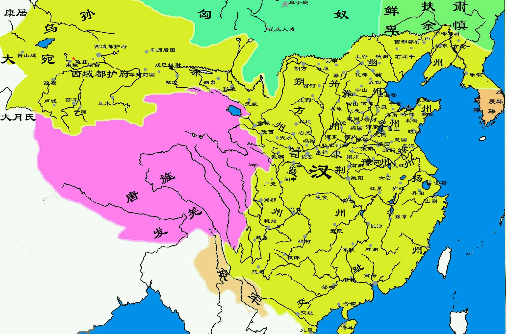

# 非驴非马

> 龟兹王后数来朝贺，乐汉衣服制度，归其国，治宫室，作徼道周卫，出入传呼，撞鐘鼓，如汉家仪。外国胡人皆曰：‘驴非驴，马非马，若龟兹王，所谓驘也。’驘，即骡，马驴杂交而生。——汉书·西域传下·渠犁

如《汉书》所言，非驴非马这个成语就是讲的西域龟兹王绛宾学习汉人仪礼。

龟兹绿洲小国，在西域诸国中确实不大，但它的地理位置很特殊，向西南，是阿克苏、喀什；向东经过轮台，可以到达焉耆、楼兰；从龟兹河上行，进入天山中部的巴音布鲁克草原，然后就能到达开阔的伊犁河谷地区。

处于这样一个具有历史意义的十字路口之上，龟兹国的命运，肯定就和地形一样，起伏不定。

这样一个城邦国家，在龟兹王绛宾继位的时候，不过只有八万多人口。忽然有一天，这个小国忽然遭到了一支五万大军的袭击，而联军统帅，竟然是汉朝的使臣常惠。

汉朝天使主持下的西域联军，为什么要打龟兹呢？

早在武帝时代，贰师将军李广利曾经西征大宛，弄了不少“天马”凯旋班师。当时，汉军途径龟兹，发现如此蕞尔小邦，竟然以盟主自居，背着汉朝私下扣押小国扜弥的王子赖丹做人质。龟兹、扜弥，皆大汉属国，龟兹没有权力让小国扜弥对它称臣。

于是，贰师将军李广利痛斥龟兹国王之后，把赖丹王子带回汉朝。昭帝时代，汉朝就派这位赖丹王子为校尉，率领部伍到轮台屯田，替汉朝守边。

眼见汉朝培植的赖丹王子临近属地，当时的龟兹王就在龟兹贵族姑翼力劝下，发兵相攻，杀掉了王子赖丹。而后，龟兹王上书汉帝，表示自己擅杀赖丹很不对，积极承认错误。龟兹国大胆妄为如此，汉朝肯定恼怒。但龟兹小国，路途迢迢，专门派军队去打它，显不出大汉威风，胜之不武。于是，就暂且搁置不提。

到了汉宣帝时代，当时杀掉赖丹的老龟兹王已经去世，绛宾继承王位。而这个时候，汉朝刚刚打完一场和匈奴的大仗，几路大军出击，唯独汉使常惠所率的乌孙雇佣军建功最多，奋击匈奴大胜而回。

常惠回到汉朝后，被赐金封侯，然后汉宣帝就派他携带大量金币，转回乌孙国，代表汉朝厚报那些协助汉朝攻打匈奴的乌孙贵族。临行，常惠忽然提起从前龟兹杀害赖丹王子的事情，希望顺便能够带着乌孙等军队教训一下龟兹。当时，怕常惠生事，汉宣帝摇头不许。临出国都，大将军霍光却暗中对常惠说，你既然代表大汉出使西域，可以见机行事。

有了当朝大将军的默许，常惠可就来精神了。到达乌孙，他以大汉天朝名义赏赐完乌孙贵族之后，就以自己所带的五百汉朝将士为主要前锋，集结西域联军近五万人，三面攻打龟兹。

正式开打前，常惠派出使者，入城谴责龟兹先前擅杀赖丹王子的罪行。

汉军最近常常打得匈奴远遁，如今，集结大军到达自己家门口，刚当国王不久的绛宾忙不迭派人求哀：“这事儿和我没关系，乃先王之时贵族姑翼撺掇先王做的，小王我无罪啊！”

常惠一听，也挺高兴，不战而屈人之兵，善之上善者也！于是他让使者传话：“既如此，把姑翼绑起来送到我们这里，我饶你不杀！”

龟兹王绛宾的执行力太强了。汉使刚刚入城送信，龟兹贵族姑翼，已经被龟兹王绛宾派人五花大绑，变成一个粽子等候汉使发落。

姑翼也倒霉，他被汉朝使者带到龟兹城外后，常惠在数万西域联军面前，以大汉帝国的名义，宣示他昔日杀掉赖丹王子的罪行，然后当众斩首。大汉恩威并重，在西域讲究信用。姑翼脑袋切下来后，常惠守信义，舍龟兹不攻，而且马上遣散西域联军，率领汉朝使团回国。

就此，龟兹和汉朝恢复了关系正常化。日后的事实证明，龟兹国王绛宾的决定非常正确。

匈奴日弱，大汉日强，龟兹蕞尔小邦，事大才可以生存。同为汉朝属国，乌孙使团一次又一次在龟兹国内休息。每次接待之时，绛宾都会从乌孙使者那里听到大汉多么强大，而且能够看到汉朝赐给乌孙的礼物是多么丰盛。不仅乌孙如此，西域诸国都是如此。只要臣服大汉，使臣一去，每次都可以从长安大打秋风，从来没有一次空手返回的。

没过多久，龟兹王绛宾心动，也想和汉朝攀上亲戚。怎么攀啊，芝麻小的国家，汉朝不可能嫁公主给自己啊。还好，一队乌孙使团路过，其中有乌孙美女第史。

这第史来历不凡，她的母亲乃是汉朝嫁到乌孙的解忧公主。第史，作为大汉公主和乌孙国王所生的女儿，够尊贵了。龟慈王绛宾爱上了第史，并与之成婚。小两口日子过得火热，解忧公主也高兴。于是，她就给宣帝上疏，希望能允许自己的女儿、女婿到长安觐见。

按理说，龟兹这种小邦国王，真没资格到长安去。岂料看在解忧公主的面子上，汉宣帝同意了。
大张旗鼓，全国总动员，龟兹王绛宾带着无数当地特产，万里迢迢，去大汉都城长安朝拜宣帝。

为了继续孤立匈奴的政策，汉廷怀柔远人，对于西域来客更是热情招待。加上有解忧公主这层关系，汉朝特别提升招待第史一行的级别，还破格正式任命第史为汉朝的公主。连同夫婿龟兹王绛宾，双双都被宣帝赐予印绶，还有象征地位和荣誉的车骑旗鼓两套，金银珍宝以及绫绸缎绮更不用讲，车载斗量，琳琅满目。

这夫妻俩在长安被招待了一年之久，才满心欢喜地回到了龟兹。在这一年时间里，绛宾眼界大开，眼福大饱，大汉的繁荣和富足，使得天天满眼黄沙的小国国主觉得自己已经在天堂里面生活了。

最终，就是这一年的富贵荣华，使得龟兹王绛宾成为铁杆的汉文化超级粉丝。回到龟兹国都，他仿效大汉宫室，按千分之一的比例缩小，也建立了自己的“宫殿”。宫里宫外，仆从宫人，都要穿戴汉式服装，行动坐卧，礼仪一依汉式！绛宾这种努力，肯定使得当时的龟兹文化焕然一新。

当然，也有人对绛宾这种小国盲目模仿汉朝文化的举止大加讥讽：驴非驴，马非马，若龟兹王，所谓骡也。“非驴非马”的成语，就是这样出来的。

这句话，显然出自龟兹周遭的西域国家，基于酸葡萄心理，他们批评绛宾的所为不伦不类。绛宾从大汉带了不知多少金银珠宝和绫罗绸缎回到龟兹，一路显摆，可把西域诸国给眼馋坏了。要知道，在当时的西域，诸小国林立，并不是所有王国都有资格直接和大汉搭上关系。绛宾形式上的汉化模仿，看似雷人，实际上也挺精明。巴结大汉朝，就等同给自己国家上了保险。到绛宾儿子辈，还真以“汉朝外孙”为标牌，天天在西域诸国面前显摆。在当时西域那样错综复杂的形势下，绛宾果断事大，完成他作为一代国王的使命。到东汉时期，龟兹已经发展成为环塔里木盆地最强大的绿洲王国。